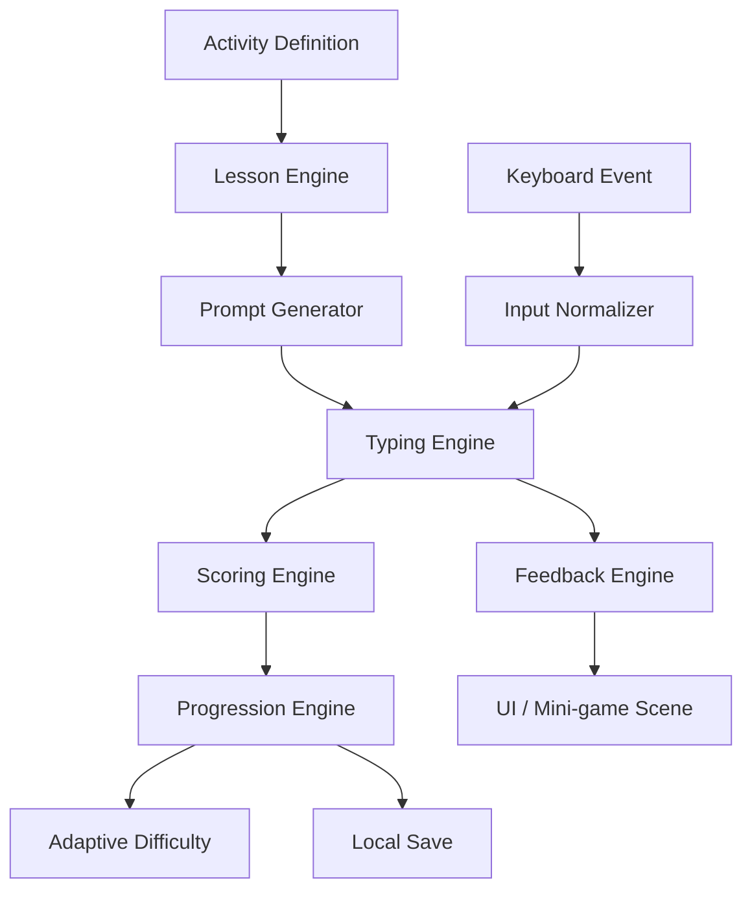

# Plan de réécriture complète — Jeu d’apprentissage de la dactylographie pour enfants (5–10 ans)

**Document de cadrage produit + technique**  
**Date : 4 mai 2026**  
**Référence analysée : KidzType / Dance Mat Typing**  
**Objectif : créer une réécriture propre, originale, cross-platform Windows / macOS / Linux / Android, responsive et adaptée aux malvoyances légères.**

---

## 1. Synthèse exécutive

Nom du projet / Produit : DactyKids
Le produit à construire est un jeu éducatif de dactylographie pour enfants de 5 à 10 ans. Il reprend les grands principes efficaces observés dans KidzType : progression par familles de touches, jeux courts, feedback immédiat, apprentissage de la rangée de repos, mini-jeux motivants, exercices de lettres, mots, phrases et paragraphes. La réécriture ne doit pas copier les assets, noms, écrans, textes ou mécaniques propriétaires ; elle doit reconstruire une expérience originale à partir de principes pédagogiques.

Le cœur du jeu doit être **un moteur de dactylographie configurable** : les mini-jeux ne sont que des habillages autour d’un même système de progression, de capture clavier, de correction, de scoring, d’accessibilité et de sauvegarde.

Recommandation d’architecture : **Flutter + Flame léger**.

- **Flutter** pour l’interface responsive, l’accessibilité, les écrans éducatifs, les menus, les réglages, la persistance locale et les builds Windows/macOS/Linux/Android.
- **Flame** ou un moteur 2D interne minimal pour les mini-jeux animés.
- **Architecture data-driven** : leçons, touches, mots, niveaux, règles de difficulté et récompenses décrits en JSON/YAML ou générés depuis des fichiers de contenu.
- **Mode offline-first**, sans compte enfant obligatoire.
- **Accessibilité visuelle native** dès la conception : contraste élevé, typographie agrandie, mode sans distraction, retours non exclusivement colorés, commandes larges, vitesse réglable.

---

## 2. Sources et limites de l’analyse

### 2.1 Sources publiques consultées

- KidzType — page d’accueil Dance Mat Typing : https://www.kidztype.com/
- KidzType — page des jeux de dactylographie : https://www.kidztype.com/browse-typing-games.html
- KidzType — programme de leçons : https://www.kidztype.com/typing-web/
- KidzType — exercices : https://www.kidztype.com/typing-web/browse-typing-exercises.html
- KidzType — pratiques : https://www.kidztype.com/typing-web/browse-typing-practice.html
- KidzType — exemple Stage 1 : https://www.kidztype.com/dance-mat-typing-level-1-stage-1_f1117a537.html
- KidzType — exemple Whack A Mole : https://www.kidztype.com/whack-a-mole_1711b3332.html
- KidzType — exemple Flappy Typing : https://www.kidztype.com/flappy-typing-1_be35d9cfe.html
- KidzType — home row lessons : https://www.kidztype.com/typing-web/browse-home-row-lessons.html
- Flutter — plateformes supportées : https://docs.flutter.dev/reference/supported-platforms
- Flutter — support desktop : https://docs.flutter.dev/platform-integration/desktop
- Flutter — design responsive/adaptatif : https://docs.flutter.dev/ui/adaptive-responsive
- Flutter — accessibilité : https://docs.flutter.dev/ui/accessibility
- Flutter — technologies d’assistance : https://docs.flutter.dev/ui/accessibility/assistive-technologies
- Godot — export platforms, utilisé ici comme comparaison : https://docs.godotengine.org/en/stable/tutorials/export/index.html
- WCAG — contraste minimum : https://www.w3.org/WAI/WCAG21/Understanding/contrast-minimum
- WCAG 2.2 — taille de cible minimum : https://www.w3.org/WAI/WCAG22/Understanding/target-size-minimum.html

### 2.2 Limites

L’analyse porte sur les contenus publics et pages accessibles. L’exécution interne exacte des jeux KidzType, les scripts, assets et états runtime ne sont pas repris. Les recommandations ci-dessous sont donc une **spécification de réécriture indépendante**, fondée sur les comportements observables et les descriptions publiques.

---

## 3. Analyse de KidzType

### 3.1 Construction générale du produit

KidzType se présente comme une plateforme web de dactylographie pour enfants, articulée autour de plusieurs sections :

1. **Dance Mat Typing** : parcours structuré en niveaux et stages.
2. **Games** : catalogue de mini-jeux thématiques.
3. **Lessons** : leçons par familles de touches.
4. **Exercises** : exercices ciblés de vitesse et précision.
5. **Practices** : pratiques plus longues, incluant lettres, phrases et paragraphes.
6. **Finger Chart** : support visuel de placement des doigts.
7. **Typing Test** : évaluation de vitesse, via service externe.

La force du dispositif est sa simplicité : l’enfant arrive sur une page, choisit une activité, appuie sur Start, tape ce qui est demandé, reçoit un feedback, puis recommence.

### 3.2 Structure pédagogique observée

KidzType/Dance Mat organise l’apprentissage selon une logique progressive :

- **Niveau 1** : rangée de repos / home row.
- **Niveau 2** : rangée supérieure.
- **Niveau 3** : rangée inférieure.
- **Niveau 4** : combinaison de toutes les rangées, majuscules, shift et ponctuation.

Le site présente 4 niveaux de Dance Mat, chacun divisé en 3 stages, soit 12 stages. Les leçons KidzType listent aussi des familles précises : home row, top row, bottom row, number row, symbol lessons et shift keys.

Le principe clé à conserver : **introduire très peu de nouvelles touches à la fois**, puis répéter les touches apprises dans des mots, séquences et jeux.

### 3.3 Boucles de gameplay identifiées

Les pages de KidzType décrivent plusieurs boucles :

#### 3.3.1 Boucle “leçon guidée”

- Introduction d’une touche ou d’un petit groupe de touches.
- Affichage de la touche cible.
- Indication du doigt à utiliser.
- Saisie d’une séquence de lettres ou de mots.
- Validation à 100 % d’exactitude ou correction immédiate.
- Progression vers le bloc suivant.

#### 3.3.2 Boucle “exercice pur”

- Série courte de caractères ou groupes de caractères.
- Objectif de précision.
- Résultat final : erreurs, exactitude, temps, éventuellement vitesse.
- Peu de narration.

#### 3.3.3 Boucle “pratique longue”

- Séquences plus longues : lettres, mots, phrases, paragraphes.
- Développement de la fluidité.
- Travail sur l’endurance et le rythme.

#### 3.3.4 Boucle “mini-jeu arcade”

Exemples observés :

- Une taupe / cible apparaît avec une lettre : l’enfant tape la lettre pour la toucher.
- Un oiseau vole tant que l’enfant tape correctement les lettres ou mots demandés.
- Une course avance lorsque les mots sont saisis correctement.
- Des ballons, fusées ou ennemis sont associés à des touches.

La mécanique commune : **un stimulus visuel porte une lettre, un mot ou une séquence ; la bonne saisie produit une action positive dans le monde du jeu.**

### 3.4 Expérience utilisateur enfant

Points forts de KidzType :

- Entrée immédiate, sans compte.
- Catalogue visible et compréhensible.
- Thèmes variés : course, espace, ninja, ballons, animaux, taupes.
- Progression très segmentée.
- Feedback rapide.
- Motivation par likes, scores, réussite et variété.

Points faibles ou à améliorer pour notre réécriture :

- Expérience web probablement variable selon la taille d’écran.
- UX assez “site web” : navigation, liens sociaux, publicité ou contenus périphériques peuvent distraire.
- Accessibilité visuelle non garantie de bout en bout.
- Peu de personnalisation visible par âge, rythme, profil sensoriel ou déficience légère.
- Langue et disposition clavier surtout orientées QWERTY/anglais ; pour un produit francophone, l’AZERTY doit être traité comme un citoyen de première classe.
- Données pédagogiques et jeu probablement peu séparés dans les anciennes pages ; la réécriture doit être data-driven.

---

## 4. Vision produit de la réécriture

### 4.1 Promesse

> “Un jeu doux, lisible et motivant qui apprend aux enfants à taper au clavier sans stress, en progressant par petites victoires.”

### 4.2 Public cible

- **5–6 ans** : découverte du clavier, repérage des lettres, coordination œil-main, sessions très courtes.
- **7–8 ans** : apprentissage structuré des rangées, précision, mémorisation des doigts.
- **9–10 ans** : vitesse, phrases, ponctuation, chiffres, autonomie, challenges doux.

### 4.3 Principes de conception petite enfance

1. **Pas d’échec humiliant** : une erreur devient une indication, pas une punition.
2. **Temps courts** : sessions de 3 à 8 minutes.
3. **Une consigne à la fois** : pas de surcharge cognitive.
4. **Feedback multi-canal** : visuel + sonore optionnel + animation + vibration sur Android si disponible.
5. **Rythme adaptatif** : difficulté qui diminue si l’enfant rate trop souvent.
6. **Récompenses non addictives** : badges, stickers, collections, encouragements, mais pas de mécanique de lootbox, publicité ou pression quotidienne.
7. **Protection** : pas de chat public, pas de profil en ligne enfant par défaut, pas d’achat intégré dans l’expérience enfant.

---

## 5. Objectifs pédagogiques

### 5.1 Compétences principales

- Identifier les touches sans regarder constamment le clavier.
- Comprendre le placement des doigts sur la rangée de repos.
- Utiliser les bons doigts pour les touches principales.
- Développer la précision avant la vitesse.
- Construire la mémoire musculaire.
- Taper lettres, mots, phrases, ponctuation et chiffres.
- Gérer majuscules et caractères spéciaux progressivement.

### 5.2 Progression pédagogique recommandée

#### Monde 1 — Le village des touches de repos

- Touches : `F`, `J`, espace, puis `D`, `K`, `S`, `L`, `A`, `;`, `G`, `H`.
- Objectif : comprendre où poser les mains.
- Activités : lettres isolées, paires symétriques, mini-mots simples.

#### Monde 2 — La forêt de la rangée supérieure

- Touches : `E`, `I`, `R`, `U`, `T`, `Y`, puis `W`, `O`, `Q`, `P`.
- Objectif : quitter puis retrouver la rangée de repos.
- Activités : alternance haut/repos, mots courts.

#### Monde 3 — La grotte de la rangée inférieure

- Touches : `V`, `M`, `B`, `N`, `C`, `,`, `X`, `.`, `Z`, `/`.
- Objectif : gestes plus difficiles, étirements contrôlés.
- Activités : précision, ralentissement volontaire.

#### Monde 4 — Le château des phrases

- Majuscules avec Shift.
- Chiffres.
- Symboles fréquents.
- Ponctuation.
- Phrases courtes.
- Paragraphes adaptés à l’âge.

#### Monde 5 — Mode expert doux

- Dictée visuelle.
- Mini-tests de vitesse sans pression.
- Challenges personnalisés.
- Objectif : fluidité, pas compétition agressive.

---

## 6. Modes de jeu

### 6.1 Mode Leçon

Objectif : apprendre un nouveau geste.

Écran type :

- Personnage guide.
- Clavier visuel.
- Main gauche / main droite stylisée.
- Touche cible agrandie.
- Courte consigne orale/textuelle.
- Zone de saisie.
- Barre de progression.

Règles :

- Nouvelle touche présentée seule.
- Puis alternée avec une touche connue.
- Puis intégrée dans un mot.
- Erreur : la touche correcte pulse, le doigt correspondant est mis en évidence.
- Pas de chronomètre visible dans les premières leçons.

### 6.2 Mode Entraînement

Objectif : répéter une compétence précise.

Exemples :

- “Seulement la rangée de repos”.
- “Seulement les touches E et I”.
- “Mots de 3 lettres”.
- “Ponctuation douce”.
- “Majuscules avec Shift”.

Paramètres :

- Durée : 1, 3, 5 ou 10 minutes.
- Difficulté : très facile, facile, normal, avancé.
- Aide visuelle : complète, partielle, minimale.
- Vitesse des stimuli : lente, normale, rapide.

### 6.3 Mode Mini-jeux

Les mini-jeux doivent être des habillages du moteur, pas des systèmes isolés.

#### Mini-jeu 1 — Les taupes des lettres

- Des taupes sortent avec une lettre.
- L’enfant tape la lettre pour les faire rentrer doucement.
- Adapté 5–7 ans.
- Très bon pour lettres isolées et chiffres.

#### Mini-jeu 2 — Les ballons

- Des ballons montent avec lettres ou mots.
- Bonne saisie : le ballon éclate avec animation douce.
- Mauvaise saisie : ballon ralentit, la lettre correcte est rappelée.
- Adapté aux entraînements visuels.

#### Mini-jeu 3 — Le vaisseau spatial

- Des météores portent des syllabes ou mots.
- La bonne saisie active un rayon.
- Adapté 7–10 ans.

#### Mini-jeu 4 — La course des animaux

- Chaque mot correct fait avancer l’animal.
- Objectif : finir la course, pas battre d’autres enfants.
- Les concurrents IA avancent doucement pour créer du rythme.

#### Mini-jeu 5 — L’oiseau du rythme

- L’oiseau garde son altitude quand la saisie est régulière.
- Une erreur ne tue pas l’oiseau ; il descend un peu et un assistant visuel aide.
- À réserver aux enfants déjà à l’aise.

#### Mini-jeu 6 — Le jardin des mots

- Chaque mot correctement tapé fait pousser une plante.
- Mode calme, sans pression temporelle.
- Très adapté aux malvoyances légères et enfants anxieux.

### 6.4 Mode Test doux

Objectif : mesurer les progrès sans anxiété.

- Durée courte.
- Mesures : précision, rythme, touches difficiles, WPM indicatif.
- Affichage : “Tu as mieux réussi les touches F et J”, “Les touches R et U méritent encore un peu d’entraînement”.
- Pas de classement public.

### 6.5 Mode Parent / Enseignant

- Création de profils locaux : prénom ou pseudonyme uniquement.
- Plusieurs profils locaux enregistrés séparément, avec progression, avatar et réglages propres à chaque enfant.
- Choix du clavier : AZERTY, QWERTY, QWERTZ, personnalisé.
- Objectifs par semaine.
- Consultation des progrès.
- Export local CSV/PDF ultérieur si besoin.
- Réglages d’accessibilité.
- Activation/désactivation du son, timer, animations, récompenses.

---

## 7. Moteur de gameplay

### 7.1 Concept central

Le moteur reçoit une **activité** composée de :

- une compétence cible ;
- un set de touches autorisées ;
- une liste de prompts ;
- une règle de difficulté ;
- une règle de scoring ;
- un habillage visuel ;
- des aides activables ;
- des contraintes d’accessibilité.

### 7.2 Types de prompts

```yaml
PromptType:
  - single_key
  - key_pair
  - random_pattern
  - syllable
  - word
  - sentence
  - paragraph
  - symbol_sequence
  - number_sequence
```

### 7.3 Exemple de définition de leçon

```yaml
id: lesson_home_f_j_space
world: home_row
age_band: [5, 10]
keyboard_layouts: [azerty_fr, qwerty_us]
new_keys: [F, J, SPACE]
review_keys: []
required_accuracy: 0.90
max_visible_prompt_length: 1
assist:
  show_keyboard: true
  show_hands: true
  show_finger_color: true
  allow_slow_mode: true
prompts:
  - type: single_key
    value: F
  - type: single_key
    value: J
  - type: pattern
    value: "F J F J SPACE"
reward:
  sticker: "etoile_debutante"
```

### 7.4 Capture clavier

Le système doit abstraire les entrées :

```text
Physical key event
    -> InputNormalizer
        -> KeyboardLayoutMapper
            -> ExpectedPromptMatcher
                -> FeedbackEngine
                -> ScoringEngine
                -> ProgressionEngine
```

Points essentiels :

- Ne pas comparer naïvement les caractères uniquement ; distinguer **touche physique**, **caractère produit**, **layout clavier** et **modificateurs**.
- Gérer AZERTY/QWERTY/QWERTZ.
- Gérer `Shift`, `Caps Lock`, `AltGr`, chiffres et symboles.
- Gérer clavier externe sur Android.
- Proposer un clavier visuel tactile pour Android, mais signaler que l’apprentissage de dactylographie réelle est optimal avec clavier physique.

### 7.5 Matching

Types de matching :

- **Exact** : la touche doit correspondre strictement.
- **Caractère** : le caractère produit correspond, peu importe la touche physique.
- **Séquence** : progression dans un mot/phrase.
- **Tolérance pédagogique** : certaines erreurs fréquentes sont détectées comme “doigt voisin”.

Exemple : si l’enfant doit taper `F` mais tape `D`, le moteur signale : “Tu étais très près, utilise l’index gauche pour F.”

### 7.6 Scoring

Le scoring ne doit pas encourager la vitesse au détriment de la précision chez les plus jeunes.

Mesures :

- **Précision brute** = frappes correctes / frappes totales.
- **Précision par touche**.
- **Temps de réaction moyen**.
- **Rythme** : régularité entre frappes.
- **WPM standard** = caractères corrects / 5 / minutes.
- **WPM ajusté** = WPM × précision.
- **Streak** : série de bonnes frappes.
- **Touches fragiles** : touches avec taux d’erreur supérieur au seuil.

Pour 5–6 ans, masquer WPM et montrer plutôt :

- étoiles de précision ;
- badges de calme ;
- progression de carte ;
- encouragements.

### 7.7 Adaptation dynamique

Si l’enfant échoue :

- réduire la vitesse ;
- agrandir la touche cible ;
- réafficher les mains ;
- repasser en lettres isolées ;
- raccourcir les mots ;
- supprimer le timer visible.

Si l’enfant réussit :

- masquer progressivement les aides ;
- introduire un mot ;
- ajouter une touche voisine ;
- proposer un mini-jeu plus rapide ;
- augmenter la longueur de séquence.

---

## 8. Expérience utilisateur détaillée

### 8.1 Parcours de démarrage

1. Écran titre clair.
2. Choix : “Je joue”, “Parent / enseignant”, “Réglages accessibilité”.
3. Première utilisation :
   - âge approximatif ;
   - type de clavier ;
   - mode visuel : standard / contraste élevé / très lisible ;
   - son activé/désactivé.
4. Tutoriel de 60 secondes :
   - poser les doigts ;
   - trouver F et J ;
   - taper espace.
5. Première leçon.

### 8.2 Écran d’activité

Composition recommandée :

```text
+--------------------------------------------------+
| Monde / Niveau      Progression        Pause     |
+--------------------------------------------------+
|                                                  |
|        Personnage / scène / mini-jeu              |
|                                                  |
|        Prompt actuel : F                          |
|                                                  |
|        Aide : index gauche                        |
|                                                  |
+--------------------------------------------------+
|          Clavier visuel + mains                   |
+--------------------------------------------------+
| Feedback texte : "Super !" ou aide douce         |
+--------------------------------------------------+
```

### 8.3 Feedback

Feedback positif :

- animation courte ;
- son doux optionnel ;
- couleur + forme ;
- personnage qui encourage ;
- vibration légère sur Android si activée.

Feedback erreur :

- jamais de son agressif ;
- jamais d’écran rouge plein ;
- pas de “Game Over” brutal ;
- message : “Regarde l’index gauche”, “Essaie la touche juste à côté”.

### 8.4 Pause

Le bouton pause doit être toujours visible.

Contenu :

- reprendre ;
- recommencer ;
- quitter ;
- régler son ;
- régler vitesse ;
- activer contraste élevé ;
- afficher aide clavier.

### 8.5 Fin de session

Écran court :

- Bravo + illustration.
- 1 à 3 points pédagogiques.
- Badge ou sticker si pertinent.
- Recommandation : “Encore 2 minutes sur R et U ?”
- Bouton : continuer / choisir un autre jeu / retour.

---

## 9. Accessibilité et malvoyances légères

### 9.1 Objectifs

L’application doit être confortable pour :

- enfants avec basse vision légère ;
- enfants avec fatigue visuelle ;
- enfants daltoniens ;
- enfants sensibles aux animations ;
- enfants ayant besoin de plus grands caractères ;
- enfants avec coordination motrice encore immature.

### 9.2 Standards cibles

- Viser **WCAG 2.2 AA** minimum pour l’interface.
- Pour les écrans enfant principaux, viser **contraste renforcé proche AAA** quand possible.
- Textes courants : contraste minimum 4.5:1.
- Gros textes : 3:1 minimum, mais viser 4.5:1 par défaut pour simplifier.
- Éléments interactifs : minimum 48×48 px en Flutter ; ne jamais descendre sous les exigences WCAG 2.2 de 24×24 CSS px pour équivalent web.

### 9.3 Modes visuels

#### Mode standard

- Couleurs joyeuses mais lisibles.
- Arrière-plan non saturé.
- Texte sombre sur fond clair ou texte clair sur fond sombre.

#### Mode contraste élevé

- Fond uni.
- Texte très contrasté.
- Suppression des textures derrière les prompts.
- Contours épais autour des touches.

#### Mode très lisible

- Taille des prompts augmentée.
- Interligne plus important.
- Clavier visuel simplifié.
- Animations réduites.
- Aucun élément décoratif derrière le texte.

#### Mode daltonisme

- Ne jamais utiliser la couleur seule pour différencier réussite/erreur/doigt.
- Ajouter icônes, motifs, labels textuels et contours.
- Tester protanopie, deutéranopie, tritanopie, niveaux de gris.

### 9.4 Typographie

- Police sans serif très lisible.
- Chiffres et lettres distinguables : `I`, `l`, `1`, `O`, `0`.
- Taille minimale recommandée :
  - UI parent : 16 px équivalent.
  - UI enfant : 20–24 px.
  - prompt principal : 48–96 px selon écran.
- Support du scaling système.
- Pas de texte important dans les images.

### 9.5 Clavier visuel accessible

- Touches larges et espacées.
- Touche cible encadrée fortement.
- Doigt attendu affiché avec icône + texte.
- Option “masquer les touches non utiles”.
- Option “grossir la touche cible”.
- Option “suivre la frappe avec un curseur épais”.

### 9.6 Animation et son

- Option réduction des animations.
- Option désactivation des flashs.
- Aucun flash rapide.
- Sons courts, doux, non essentiels.
- Tous les feedbacks sonores ont un équivalent visuel.
- Volume du jeu indépendant du système si possible.

### 9.7 Lecteurs d’écran

Même si le cœur du jeu est visuel, les menus, paramètres et résultats doivent être utilisables au lecteur d’écran.

À prévoir :

- labels sémantiques sur boutons ;
- ordre de focus logique ;
- descriptions des résultats ;
- annonce optionnelle du prompt ;
- pas de changement de contexte automatique pendant la saisie ;
- tests avec TalkBack Android, VoiceOver macOS/iOS si build iOS ultérieur, Narrator/NVDA Windows, Orca Linux si possible.

---

## 10. Responsive et adaptation cross-platform

### 10.1 Plateformes cibles

- Windows 10/11+.
- macOS moderne.
- Linux desktop.
- Android tablette et téléphone, idéalement avec clavier externe.

### 10.2 Breakpoints UI

#### Petit écran — téléphone Android

- Layout vertical.
- Prompt très grand.
- Clavier visuel condensé.
- Mini-jeux simplifiés.
- Mode tactile éducatif.
- Avertissement doux : “Pour apprendre la dactylo avec les doigts, branche un clavier si tu peux.”

#### Moyen écran — tablette

- Layout vertical large ou horizontal.
- Clavier visuel complet.
- Personnage à côté du prompt.
- Très adapté aux enfants.

#### Grand écran — desktop

- Layout horizontal.
- Zone de jeu large.
- Clavier visuel bas.
- Panneau latéral possible pour progression.
- Support souris/clavier.

### 10.3 Orientation

- Android : portrait et paysage.
- Desktop : fenêtre redimensionnable.
- Aucun contenu critique coupé.
- Respect des safe areas.

### 10.4 Densité visuelle

Options :

- compacte ;
- standard ;
- très lisible.

Sur petit écran, ne pas afficher tous les indicateurs en permanence. Priorité : prompt, touche cible, feedback.

---

## 11. Architecture technique recommandée

### 11.1 Stack principale

- **Flutter** : application multi-plateforme, UI, accessibilité, navigation, stockage.
- **Flame** : mini-jeux 2D animés quand nécessaire.
- **Dart** : logique métier.
- **Drift / SQLite** ou stockage local équivalent : progression, profils locaux, réglages.
- **Riverpod / Bloc** : gestion d’état.
- **freezed / json_serializable** : modèles immuables et parsing de contenu.
- **go_router** : navigation.
- **audio players léger** : sons courts.

### 11.2 Pourquoi Flutter + Flame

Avantages :

- Un codebase pour Android + desktop.
- UI responsive/adaptative solide.
- Bonne intégration de l’accessibilité.
- Gestion simple des menus et paramètres.
- Flame peut gérer les mini-jeux sans imposer un moteur lourd.
- Les mini-jeux restent intégrés à l’application, pas dans un runtime séparé.

Alternatives :

- **Godot** : très bon si le produit devient avant tout un jeu 2D animé complet. Moins naturel pour l’UI éducative riche, formulaires parent, accessibilité fine et responsive applicatif.
- **Web/PWA + Electron/Tauri/Capacitor** : possible, mais plus complexe pour une expérience Android/desktop homogène et les événements clavier fiables.
- **Unity** : surdimensionné pour ce produit, build plus lourd, UX enfant/accessibilité UI plus coûteuse.

### 11.3 Architecture logique

```text
app/
  presentation/
    screens/
    widgets/
    themes/
    accessibility/
  game/
    flame_scenes/
    mini_games/
    animation/
  domain/
    typing_engine/
    lesson_engine/
    scoring/
    progression/
    adaptation/
    keyboard/
  data/
    content_repository/
    local_storage/
    profiles/
    settings/
  content/
    lessons/
    word_lists/
    keyboard_layouts/
    rewards/
  platform/
    desktop/
    android/
```

### 11.4 Architecture moteur



### 11.5 Séparation contenu / code

Le contenu pédagogique doit être indépendant :

```text
content/
  layouts/
    azerty_fr.yaml
    qwerty_us.yaml
    qwertz_de.yaml
  lessons/
    home_row_01.yaml
    top_row_01.yaml
  wordlists/
    fr_age_5_6.yaml
    fr_age_7_8.yaml
    fr_age_9_10.yaml
  accessibility_presets/
    standard.yaml
    high_contrast.yaml
    low_vision.yaml
```

Bénéfices :

- ajout de langues ;
- adaptation clavier ;
- équilibrage pédagogique sans recoder ;
- tests automatisés sur contenu ;
- possibilité future de packs enseignants.

---

## 12. Modèles de données

### 12.1 Profile enfant

```dart
class ChildProfile {
  final String id;
  final String displayName; // pseudonyme possible
  final int? age;
  final KeyboardLayoutId keyboardLayout;
  final AccessibilityPreset accessibilityPreset;
  final DateTime createdAt;
}
```

### 12.2 Progression

```dart
class ProgressSnapshot {
  final String childId;
  final Map<String, LessonProgress> lessons;
  final Map<String, KeyStats> keyStats;
  final List<RewardId> rewards;
  final DateTime updatedAt;
}
```

### 12.3 Statistiques par touche

```dart
class KeyStats {
  final String keyId;
  final int attempts;
  final int correct;
  final int errors;
  final Duration averageReactionTime;
  final DateTime lastPracticedAt;
}
```

### 12.4 Résultat de session

```dart
class SessionResult {
  final String activityId;
  final Duration duration;
  final int totalKeystrokes;
  final int correctKeystrokes;
  final int errors;
  final double accuracy;
  final double? wpm;
  final List<String> difficultKeys;
  final List<String> masteredKeys;
}
```

---

## 13. Contenus pédagogiques

### 13.1 Français et clavier AZERTY

Priorité produit :

- AZERTY français dès le MVP.
- QWERTY US en second layout.
- Textes français adaptés par âge.
- Mots fréquents, non anxiogènes, faciles à lire.
- Exclure mots violents, ambigus ou trop adultes.

### 13.2 Progression mots

#### 5–6 ans

- lettres isolées ;
- syllabes simples ;
- mots très courts : chat, papa, lune, ami, sac ;
- peu ou pas de ponctuation.

#### 7–8 ans

- mots de 3 à 6 lettres ;
- phrases simples ;
- accents optionnels dans un premier temps ;
- ponctuation douce : point, virgule.

#### 9–10 ans

- phrases plus longues ;
- paragraphes courts ;
- chiffres ;
- majuscules ;
- symboles utiles.

### 13.3 Accents français

Sujet sensible pour la dactylo :

- Introduire d’abord lettres non accentuées.
- Puis accents fréquents : `é`, `è`, `à`, `ç`, `ù`.
- Afficher clairement la combinaison si nécessaire.
- Mode simplifié : ignorer accents dans certains mini-jeux.
- Mode avancé : exiger accents exacts.

---

## 14. Récompenses et motivation

### 14.1 Principes

- Récompenser l’effort et la précision, pas uniquement la vitesse.
- Pas de classement global entre enfants.
- Pas de monétisation intégrée dans les boucles enfant.
- Pas de pression quotidienne.
- Les récompenses doivent rester pédagogiques.

### 14.2 Système proposé

- Stickers de monde.
- Cartes de personnages.
- Décoration d’un jardin ou d’une chambre virtuelle.
- Badges : “J’ai trouvé F et J”, “10 frappes calmes”, “J’ai aidé mon index gauche”.
- Couronnes de précision, pas de “meilleur que les autres”.

### 14.3 Feedback verbal

Exemples :

- “Tu progresses.”
- “Belle précision.”
- “Essaie plus lentement, c’est normal.”
- “Ton index gauche travaille bien.”
- “Encore une petite série et on fait une pause.”

À éviter :

- “Raté !”
- “Trop lent !”
- “Game over” brutal.
- “Tu as perdu.”

---

## 15. Sécurité, vie privée et usage enfant

### 15.1 Principes

- Offline-first.
- Aucun compte enfant obligatoire.
- Pseudonymes locaux.
- Pas de chat.
- Pas de partage social dans l’interface enfant.
- Pas de publicités dans l’expérience enfant.
- Pas de collecte de données sans consentement parental explicite.
- Les données de progression restent locales par défaut.

### 15.2 Mode enseignant

Si une synchronisation future est envisagée :

- consentement adulte ;
- minimisation des données ;
- chiffrement ;
- export/suppression ;
- anonymisation possible ;
- revue juridique RGPD/COPPA avant toute mise en production.

---

## 16. Roadmap fonctionnelle

### 16.1 MVP — Version 0.1

Objectif : prouver le moteur d’apprentissage.

Fonctionnalités :

- Flutter desktop + Android buildable.
- Plusieurs profils locaux séparés.
- Choix AZERTY/QWERTY.
- 6 leçons home row.
- Clavier visuel accessible.
- Capture clavier physique.
- Feedback correct/erreur.
- Sauvegarde locale basique.
- Progression séparée par profil local.
- Mode contraste élevé.
- Résultat de session simple.
- 1 mini-jeu : taupes ou ballons.

Critères d’acceptation :

- Un enfant peut finir une première leçon sans aide adulte.
- Les touches F/J/espace sont comprises.
- L’app reste utilisable en 1280×720 desktop et tablette Android.
- Le mode contraste élevé respecte les ratios minimum.

### 16.2 Alpha — Version 0.3

- Tous les niveaux home row + top row.
- 3 mini-jeux.
- Profils multiples locaux.
- Statistiques par touche.
- Adaptation dynamique simple.
- Mode réduction d’animations.
- Premiers tests utilisateurs enfants.

### 16.3 Beta — Version 0.7

- Home/top/bottom rows complètes.
- Mode pratique mots et phrases.
- Mode parent/enseignant.
- Export local des progrès.
- Audio complet.
- 5 mini-jeux.
- Tests accessibilité.
- Pack français complet 5–10 ans.

### 16.4 Version 1.0

- Parcours complet.
- Chiffres, symboles, majuscules.
- Tests doux.
- Réglages accessibilité complets.
- Packaging Windows/macOS/Linux/Android.
- Documentation parent/enseignant.
- CI/CD multi-plateforme.

### 16.5 Évolutions futures

- Packs de langues.
- Packs dyslexie-friendly.
- Claviers personnalisés.
- Mode classe local.
- Synchronisation facultative.
- Générateur d’exercices enseignant.
- Mode “dictée audio”.
- Support iOS si nécessaire.

---

## 17. Plan de production

### Phase 1 — Prototype technique

Livrables :

- skeleton Flutter ;
- écran activité ;
- capture clavier ;
- clavier visuel ;
- leçon F/J/espace ;
- stockage local ;
- thème contraste élevé.

### Phase 2 — Moteur de contenu

Livrables :

- chargement YAML/JSON ;
- modèle ActivityDefinition ;
- PromptGenerator ;
- progression ;
- scoring ;
- tests unitaires du moteur.

### Phase 3 — Mini-jeu 1

Livrables :

- scène Flame ou widget animé ;
- intégration moteur ;
- feedback visuel/sonore ;
- réglage vitesse ;
- compatibilité accessibilité.

### Phase 4 — UX enfant complète

Livrables :

- personnage guide ;
- parcours monde ;
- fin de session ;
- récompenses ;
- pause ;
- transitions.

### Phase 5 — Accessibilité et responsive

Livrables :

- presets visuels ;
- scaling texte ;
- tests contraste ;
- focus navigation ;
- lecteur d’écran pour menus ;
- tests petits/grands écrans.

### Phase 6 — Packaging

Livrables :

- builds Windows/macOS/Linux/Android ;
- installateurs ;
- signatures éventuelles ;
- guide de distribution ;
- tests de performance.

---

## 18. Tests et qualité

### 18.1 Tests unitaires

- InputNormalizer.
- KeyboardLayoutMapper.
- PromptMatcher.
- ScoringEngine.
- AdaptiveDifficulty.
- Content validation.

### 18.2 Tests widget

- écran leçon ;
- clavier visuel ;
- pause ;
- résultats ;
- réglages accessibilité.

### 18.3 Tests intégration

- parcours première leçon ;
- erreurs fréquentes ;
- changement de layout ;
- sauvegarde/restauration ;
- sortie/reprise d’activité.

### 18.4 Tests accessibilité

- contraste automatisé des palettes ;
- taille de cible ;
- navigation clavier ;
- scaling texte 200 % ;
- mode niveaux de gris ;
- TalkBack Android pour menus ;
- VoiceOver/Narrator/NVDA/Orca selon plateforme de validation.

### 18.5 Tests utilisateurs

Panels recommandés :

- 3 enfants de 5–6 ans ;
- 3 enfants de 7–8 ans ;
- 3 enfants de 9–10 ans ;
- 1 à 2 enfants avec basse vision légère si possible ;
- parents/enseignants observateurs.

Mesures :

- compréhension sans explication ;
- frustration ;
- temps avant première réussite ;
- visibilité du prompt ;
- erreurs récurrentes ;
- fatigue visuelle ;
- envie de recommencer.

---

## 19. Risques et parades

| Risque | Impact | Parade |
|---|---:|---|
| Android sans clavier physique | Moyen | mode tactile + message doux + support clavier externe |
| Trop de mini-jeux isolés | Élevé | moteur commun data-driven |
| Accessibilité ajoutée trop tard | Élevé | presets dès MVP, tests contraste automatisés |
| Enfant cherche la vitesse trop tôt | Moyen | précision prioritaire, WPM masqué chez les petits |
| Layout AZERTY mal géré | Élevé FR | abstraction touche physique/caractère/layout |
| Surcharge visuelle | Élevé | mode très lisible, décor derrière texte interdit |
| Frustration par erreur | Élevé | feedback doux, adaptation dynamique |
| Assets trop nombreux | Moyen | style vectoriel simple, composants réutilisables |
| Données enfant sensibles | Élevé | local-first, pas de compte enfant par défaut |

---

## 20. Backlog initial

### Épique A — Base application

- Initialiser projet Flutter.
- Ajouter architecture dossiers.
- Ajouter navigation.
- Ajouter thèmes standard / contraste élevé.
- Ajouter stockage local.

### Épique B — Moteur clavier

- Définir KeyboardLayout.
- Implémenter AZERTY FR.
- Implémenter QWERTY US.
- Normaliser événements clavier.
- Gérer Shift.
- Tests unitaires.

### Épique C — Moteur leçon

- ActivityDefinition.
- PromptGenerator.
- PromptMatcher.
- SessionState.
- FeedbackEngine.
- ScoringEngine.

### Épique D — UI enfant

- Écran monde.
- Écran leçon.
- Clavier visuel.
- Prompt géant.
- Feedback doux.
- Résultat de session.

### Épique E — Mini-jeu 1

- Choisir taupes ou ballons.
- Créer scène.
- Brancher moteur.
- Ajouter assets simples.
- Ajouter réglages vitesse.

### Épique F — Accessibilité

- Preset basse vision.
- Taille texte réglable.
- Mode animations réduites.
- Focus visible.
- Labels sémantiques.
- Contraste automatisé.

### Épique G — Contenu

- Leçons home row.
- Listes mots 5–6 ans.
- Listes mots 7–8 ans.
- Listes mots 9–10 ans.
- Validation contenu.

---

## 21. Critères de réussite produit

### À 30 jours

- Prototype jouable.
- Première leçon finissable.
- 1 mini-jeu jouable.
- Sauvegarde locale.
- Mode contraste élevé.

### À 90 jours

- Parcours home row complet.
- 3 mini-jeux.
- Tests utilisateurs enfants.
- Premiers rapports de progression.
- Builds Windows/Linux/Android validés.

### À 180 jours

- Parcours complet lettres.
- Chiffres/majuscules en bêta.
- Accessibilité testée.
- Packaging multi-plateforme.
- Documentation parent/enseignant.

---

## 22. Décisions recommandées maintenant

1. Démarrer avec **Flutter + Flame**.
2. Faire du **clavier AZERTY FR** le layout prioritaire.
3. Construire d’abord le **moteur**, puis les mini-jeux.
4. Faire un MVP centré sur la **rangée de repos**.
5. Intégrer contraste élevé et scaling texte dès le premier sprint.
6. Éviter compte en ligne, pub, social sharing et leaderboard public.
7. Tester très tôt avec de vrais enfants, même sur prototype laid.

---

## 23. Définition du MVP précis

Le MVP doit contenir :

- Écran d’accueil.
- Réglage clavier : AZERTY / QWERTY.
- Réglage accessibilité : standard / contraste élevé / très lisible.
- Leçon 1 : F, J, espace.
- Leçon 2 : D, K.
- Leçon 3 : S, L.
- Leçon 4 : A, ; ou touche équivalente selon layout.
- Leçon 5 : G, H.
- Leçon 6 : révision home row.
- Mini-jeu “Ballons des lettres” ou “Taupes des lettres”.
- Écran résultat.
- Sauvegarde locale.
- Tests unitaires du moteur.

Ce MVP suffit pour valider :

- la capture clavier ;
- la pédagogie ;
- l’accessibilité ;
- le responsive ;
- l’intérêt enfant ;
- l’architecture de contenu.

---

## 24. Exemple de première session enfant

1. L’enfant lance le jeu.
2. Il choisit un avatar simple.
3. Le personnage dit : “Pose tes doigts sur F et J. Les petites bosses aident tes doigts.”
4. La touche F s’illumine.
5. L’enfant tape F.
6. Un ballon s’ouvre, feedback positif.
7. La touche J s’illumine.
8. L’enfant tape une mauvaise touche.
9. Le jeu dit : “Presque ! Regarde l’index droit sur J.”
10. La touche J devient plus grande.
11. L’enfant réussit.
12. La session se termine après une série courte.
13. Résultat : “Tu as trouvé F et J. Bravo pour ta précision.”

---

## 25. Conclusion

La réécriture doit viser un produit plus moderne, plus accessible et plus robuste que la référence web analysée. Le cœur de la réussite sera moins le nombre de mini-jeux que la qualité du moteur pédagogique : progression, feedback, adaptation, clavier visuel, accessibilité et contenus adaptés à l’âge.

Le meilleur premier jalon est un prototype Flutter jouable avec une seule compétence : **F/J/espace**, rendu agréable, lisible, accessible et techniquement propre. Une fois ce noyau validé, tous les mini-jeux deviennent des variantes visuelles d’une mécanique déjà solide.
